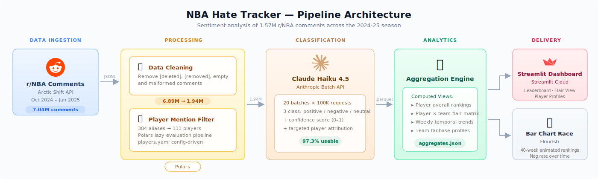

# 🏀 NBA Hate Tracker


**Who does r/NBA hate the most?**

A sentiment analysis pipeline that analyzed **1.57 million Reddit comments** from the 2024-25 NBA season to find out. The answer: **Draymond Green**.

📊 [**Explore the Dashboard**](https://nba-hate-tracker.streamlit.app)

---

## The Answer

Draymond Green holds a **51.0% negative comment rate** across 53,454 comments — no other player combines that level of negativity with that volume of discussion. He's the most hated player according to **22 of 30 NBA fanbases**. Utah Jazz fans lead the charge at 63.6% negativity.

But he didn't start the season on top. Westbrook and Harden opened as the most hated, with Bronny James briefly spiking to #2 during his early-season scrutiny. By late October, Ben Simmons surged into the top 2 and the mid-season settled into a three-way rotation between Simmons, Jamal Murray, and Embiid trading the top spots. Draymond entered the top 5 in early December and climbed steadily, first reaching #1 in February — but he and Embiid traded places through mid-March before Draymond finally locked down the top spot from late April through the end of the season.


## Architecture

The pipeline processes Reddit comments through five stages: ingestion from Arctic Shift archives, cleaning and filtering to player-mention comments, sentiment classification via the Anthropic Batch API, aggregation into dashboard-ready views, and delivery via a Streamlit dashboard and Flourish bar race animation.



| Stage | Volume | Notes |
|-------|--------|-------|
| Raw download | 7,041,235 | r/NBA comments via Arctic Shift API (Oct 2024 – Jun 2025) |
| Cleaned | 6,891,163 | Removed [deleted], [removed], empty, and malformed comments |
| Player-mention filtered | 1,939,290 | Matched against 384 aliases for 111 players |
| Classified | 1,886,133 | Sentiment labeled (neg / neu / pos); 2.75% error rate excluded |
| Attributed | 1,567,722 | Multi-player comments resolved to single target (83% attribution rate; ~17% ambiguous dropped) |

## Classifier

Sentiment classification uses **Claude Haiku 4.5** via the [Anthropic Batch API](https://docs.anthropic.com/en/docs/build-with-claude/batch-processing), which provides a 50% cost reduction over synchronous requests.

Each comment is classified as **negative**, **neutral**, or **positive** with a confidence score and the target player identified. The prompt handles NBA-specific slang — "washed," "cooked," and "fraud" register as negative while "nasty," "filthy," and "GOAT" register as positive.

**Batch processing at scale:**

- 20 batches of up to 100K requests (~20 hours wall clock)
- 248.5M input tokens + 52.0M output tokens (300.5M total)
- 97.25% usable classification rate
- $254 total cost — output tokens are 17% of volume but 51% of cost (5× per-token price)
- Validated against 500 human-labeled comments at ~96% accuracy

## Key Findings

**Most Hated (by negative comment rate, min. 5K comments):**

| Rank | Player | Neg Rate | Comments |
|------|--------|----------|----------|
| 1 | Draymond Green | 51.0% | 53,454 |
| 2 | Joel Embiid | 49.3% | 31,538 |
| 3 | Ben Simmons | 45.6% | 11,123 |
| 4 | Russell Westbrook | 45.2% | 40,571 |
| 5 | James Harden | 44.1% | 28,504 |

**Notable findings:**

- **Volume ≠ hate** — Luka Dončić generates the most raw negative comments (49.6K) but ranks middling in neg_rate (37.2%). LeBron is similar: 137K total comments, below-average negativity. Being talked about constantly doesn't mean being hated.
- **Polarizing ≠ hated** — Westbrook is r/NBA's most polarizing player (68.3% of comments carry strong sentiment) but only #4 in neg_rate, because 23.1% of his comments are *positive* — he has vocal defenders. Draymond drops from #1 in hate to #7 in polarization because almost nobody defends him (14.5% positive). OKC fans rate Westbrook at 24.2% negative — 21 points below his average. Lakers fans rate him at 55.1%. Same player, completely different perception.
- **Flair reveals rivalries** — Jazz fans are the most negative fanbase toward Draymond (63.6%), likely driven by the Rudy Gobert history. Simmons' two most hostile fanbases are his two former teams (Sixers at 59.2%, Nets at 48.0%).
- **r/NBA is structurally negative** — Only 11 of 59 qualified players have positive net sentiment. Draymond's -0.366 is roughly 1.7× as extreme as the most positive player (Wembanyama at +0.217). The subreddit's ceiling for hate far exceeds its ceiling for love.

## Limitations

- **Classifier accuracy ~96%** — validated against 500 human-labeled comments. Edge cases include sarcasm, backhanded compliments, and basketball idioms (e.g., "Towns going to town on us" classified as negative when it's praise).
- **Sentiment ≠ hate** — a factual criticism ("he shot 2-15 last night") and a personal attack both register as negative. The metric measures negativity of discourse, not pure hostility.
- **Equal weighting** — every comment counts the same regardless of Reddit score. A comment with 500 upvotes has the same weight as one with 1. This avoids popularity bias but means viral threads don't carry extra influence.
- **One season only** — results reflect the 2024-25 season. Player sentiment shifts with trades, injuries, and playoff performance.

## Tech Stack

| Component | Technology |
|-----------|------------|
| Language | Python 3.11 |
| Data Processing | Polars |
| Classifier | Claude Haiku 4.5 (Anthropic Batch API) |
| Data Source | Arctic Shift API (Reddit archives) |
| Dashboard | Streamlit |
| Bar Race Animation | Flourish |
| Package Manager | uv |
| Player Config | YAML (384 aliases → 111 players) |

## Project Structure

```
nba-hate-tracker/
├── pipeline/           # Core data processing modules
│   ├── arctic_shift.py     # API client for Reddit archives
│   ├── processors.py       # Comment cleaning & player matching
│   ├── batch.py            # Anthropic Batch API integration
│   └── aggregation.py      # Sentiment aggregation engine
├── scripts/            # CLI entry points
│   ├── download_comments.py
│   ├── download_posts.py
│   ├── clean_raw_comments.py
│   ├── extract_filter.py
│   ├── filter_player_mentions.py
│   ├── prepare_batches.py
│   ├── submit_batches.py
│   ├── collect_results.py
│   ├── aggregate_sentiment.py
│   └── export_bar_race.py
├── utils/              # Stateless helpers
│   ├── constants.py
│   ├── formatting.py
│   ├── paths.py
│   ├── player_config.py
│   └── team_config.py
├── app/                # Streamlit dashboard
│   ├── 🏆_Leaderboard.py
│   ├── pages/
│   │   ├── 1_👥_Flair_View.py
│   │   ├── 2_🔍_Player_Detail.py
│   │   └── 3_ℹ️_About.py
│   └── utils/data.py
├── config/             # Player aliases & team mappings
├── tests/              # pytest unit tests
└── notebooks/          # EDA & validation (6 notebooks)
```

## Cost

| Phase | Cost |
|-------|------|
| Data acquisition & processing | $0 |
| Sentiment classification (Batch API) | $254.20 |
| Dashboard hosting (Streamlit Cloud) | $0 |
| **Total** | **$254.20** |

Initial naive cost estimate was $1,156 (2.8M comments, verbose prompt). Three optimizations brought it down 78%: player-mention filtering cut comments from 2.8M to 1.9M (-31%), a minimal prompt halved input tokens (261 → 128 per comment), and dropping the unused `reasoning` field slashed output tokens (112 → 23 per comment).

---

<p align="center">
  Built by <a href="https://github.com/oluobiri">@oluobiri</a> · Data sourced from <a href="https://arctic-shift.photon-reddit.com/">Arctic Shift</a>
</p>