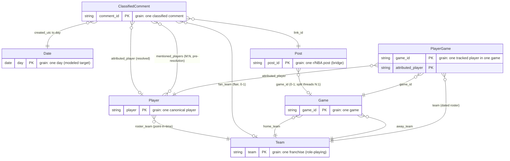

# Data Model — NBA Hate Tracker

**Purpose:** The shared conceptual vocabulary for V2 dashboard design. A new dashboard view is a question asked against this model; having the model written down is what lets you tell at a glance whether a question is **cheap** (already in an aggregate), **needs a join** (a dimension lookup, no new pipeline output), or **expensive** (a new aggregate view the pipeline must produce).

**How to read it:** The core model below — the ER diagram, the entity key, and the view-lineage table — is the authoritative *"is"*: what the pipeline produces today. The single fenced section at the very end, **Forward look (v3)**, is *"will be"* — direction, not built. Nothing in that section touches the core diagram or the present-now key.

`pipeline/schemas.py` is the source of truth for column *structure* (names + dtypes). This doc is the source of truth for the *relationships* between those structures.

---

## The model at a glance

A **star schema**: one fact at the center — `ClassifiedComment` — with three dimensions radiating out, plus the **game layer**: `Game`, a dimension here (a fact in a basketball model — fact-vs-dimension is relative to the star you're in), `PlayerGame`, one tracked player's box-score line in one game, and `Post`, the **bridge** from a comment to the game it lived in. `Team` is a **role-playing dimension**: the same franchise table is referenced in four distinct roles (a player's *roster* team, a commenter's *fan* team, and a game's *home* and *away* teams). `Date` is a **modeled target** — it does not exist as a table today (temporal lives as a derived `week` column), but the model names it because the V2 temporal work is built against it.

The diagram carries **structure only** — entity boxes, the role-playing edges, and each box's grain/key. Full attribute lists live in the entity key below, so the diagram stays readable and so forward-look attributes never appear to already exist.

The pipeline produces three classes of table from this model: **rollups** of the `ClassifiedComment` fact (the five aggregate views — `player_overall`, `player_temporal`, `player_team`, `team_overall`, `game_sentiment`: measures at a coarser grain), the **dimensions** (`players`, `teams`, `games`), and a **fact subset** (`comment_samples`: verbatim rows of the fact at its own grain, selected not aggregated). `PlayerGame` is materialized as `player_games`, a dimension-side table with its own grain, and `Post` as `posts`, the bridge at its own grain. The subset is not a new entity — it *is* the `ClassifiedComment` box, sliced; the rollups are derived from the fact, not from the subset. The lineage of all of them is the table in §4.

---

## 1. Entity key

### `ClassifiedComment` — fact

**Grain:** one classified comment (one row in `sentiment.parquet`). Comment and its classification are **one entity, not two**: they share a grain (each comment gets exactly one sentiment, one confidence, one resolved player), and the classification has no independent existence apart from the comment it describes. The classification fields belong *on the fact*, not in a separate dimension — `confidence` as a measure, `sentiment` as a categorical attribute you group by. (Where this doc says "comment," it means this entity — there is no separate raw-comment entity in the model.)

| Field | Role |
|---|---|
| `comment_id` | degenerate id (PK) |
| `body`, `author`, `created_utc`, `score` | event attributes |
| `sentiment` | categorical attribute (junk-dimension candidate) — you group by it; the `neg_count` / `pos_count` / `neu_count` rollups derived from it are the measures |
| `confidence` | numeric measure |
| `mentioned_players[]` | → **Player**, M:N — substring matches re-derived from `body` at assembly time under the active `players.yaml`, *pre-resolution* |
| `sentiment_player` | the classifier's single pick — a disambiguation input |
| `attributed_player` | → **Player**, the *resolved* single FK the aggregate views key on — materialized on the fact at assembly |
| `author_flair_text` → `fan_team` | → **Team** (fan role), 0-or-1 (flair may not resolve) — materialized on the fact at assembly |
| `link_id` | → **Post**, the post the comment lived in; the comment's only path to a **Game** |
| `created_utc` → `day` | → **Date** |

**The player FK is resolved, not raw.** `mentioned_players[]` (M:N) and `sentiment_player` are the *inputs*; `resolve_player()` collapses them to a single `attributed_player` (or null), and the result is stored on the fact. The fact tables join on `attributed_player`. ~1.57M of ~1.93M classified rows resolve to a player.

**Resolution happens once, at assembly.** `attributed_player` and `fan_team` are columns of `sentiment.parquet`, not something a reader derives. Every consumer of the fact — the aggregate views, the receipts pool, notebooks, anything reading the parquet outside Python — sees the same resolution, because there is exactly one. A reader that re-implemented the resolver would drift from the pipeline the first time an alias changed; storing the derivation under a config stamp is what makes that class of bug impossible.

**Two provenance layers on the fact.** The fact's attributes split into two classes with opposite change semantics:

- **Population + event/classification fields** — frozen at filter/classification time: `body`, `author`, `created_utc`, `score`, `link_id`, `sentiment`, `confidence`, `sentiment_player`. Re-running assembly never changes them; which comments exist in the fact (the population) is part of this frozen layer.
- **Config-versioned derivations** — `mentioned_players` and `attributed_player`, caches of `f(body, sentiment_player, players.yaml@version)`, and `fan_team`, a cache of `f(author_flair_text, teams.yaml@version)`: re-derived at every assembly and stamped with their config `version` into the parquet's file metadata (`players_config_version`, `teams_config_version`). Both stamps are checked at aggregation read time (drift → WARNING) — the config `version` field (major = roster, minor = alias) is load-bearing lineage metadata, not documentation.

The distinction matters because the two layers age differently: frozen fields stay correct forever, while a stored derivation is only as current as the config it was derived under — copying it forward through a rebuild silently reintroduces every alias fix made since. That is why the derived columns are never projected from an earlier file: assembly recomputes all three from the frozen layer, so a rebuild under a newer config is a correct rebuild by construction. `teams.parquet` carries the same `teams.yaml` stamp for the dimension side.

### `Player` — dimension

**Grain:** one canonical player. Materialized as `players.parquet`: the curated layer from `config/<season>/players.yaml` LEFT JOINed on `player_id` with the season roster snapshot (`data/<season>/reference/rosters.parquet`) — a snapshot gap nulls the snapshot attributes, it never drops the row. The nested `player_metadata` dict inside `aggregates.json` is a legacy serialization of the same dimension (curated attributes only).

| Field | Notes |
|---|---|
| `player` | canonical name (PK) |
| `roster_team` | → **Team** (roster role), from config. **Point-in-time** — see §3 |
| `conference`, `player_id`, `headshot_url` | curated attributes (config) |
| `position`, `birth_date`, `experience`, `school`, `jersey_number`, `height`, `weight` | snapshot attributes (roster snapshot, joined on `player_id`). Age is derived from `birth_date` at read time — a stored age is frozen at fetch |
| `aliases[]` | the substring fragments feeding `mentioned_players` matching. **Config-only, never materialized**: the dimension describes and slices; it does not select the population (selection = config tracked set + fact-side qualification) |

### `Team` — dimension (role-playing)

**Grain:** one franchise. Materialized as `teams.parquet`: a pure export of `config/teams.yaml` — all 30 franchises in config order, no fact dependency. The file carries the `teams.yaml` `version` in its parquet metadata (the same lineage stamp mechanism as the Player dimension). Referenced in **two roles** today (see §2).

| Field | Notes |
|---|---|
| `team` | canonical name (PK) |
| `abbreviation`, `conference`, `team_id`, `logo_url` | descriptive attributes |
| `aliases[]` | the flair fragments feeding `fan_team` resolution |

### `Game` — dimension

**Grain:** one game. Materialized as `games.parquet`, pivoted from the season's team game-log snapshot (`data/<season>/reference/team_game_log.parquet`, stats.nba.com `LeagueGameLog`, every season type). The snapshot holds both sides of every game as the endpoint serves them; the dimension decides what ships: exhibitions against non-NBA opponents are dropped, and a game whose two lines both read "away" (a neutral site) is flagged, its sides assigned by `team_id` so the row does not depend on endpoint order.

| Field | Notes |
|---|---|
| `game_id` | stats.nba.com id (PK); the prefix encodes the season type and, for playoffs, `004 YY 00 R S G` |
| `game_date`, `season_type` | `pre_season` / `regular_season` / `play_in` / `playoffs`, decoded from the id prefix; the NBA Cup final (its own prefix) sits in the regular-season window under `nba_cup_final` |
| `home_team`, `away_team`, `winner` | → **Team** (home / away roles), canonical names |
| `home_score`, `away_score` | measures of the game, not of the star |
| `playoff_round`, `playoff_series`, `playoff_game` | parsed from the id; null outside the playoffs |
| `neutral_site` | see above |

### `PlayerGame` — one player in one game

**Grain:** one tracked player's box-score line in one game. Materialized as `player_games.parquet` from the player game-log snapshot (`player_game_log.parquet`, every player who dressed), selected to the Player dimension by `player_id` under the active `players.yaml`. A tracked player with no line is absent, never fabricated. Not a rollup of the fact — it carries the game's measures (`pts`, `reb`, `plus_minus`, …), and the comment-side view at the same grain is a separate rollup, `game_sentiment` (see §4).

| Field | Notes |
|---|---|
| `game_id`, `attributed_player` | PK; → **Game**, → **Player** (the dimension's key name, so the join to the comment-side view at this grain is on identical columns) |
| `team` | → **Team**, the **dated roster role**: the player's team on that line — see §3 |
| `opponent`, `is_home` | → **Team**; `is_home` is derived from `games.home_team`, and null on a neutral-site game, where neither side hosted |
| `wl`, `minutes`, the box-score line, `plus_minus` | as the endpoint serves them |

### `Post` — bridge

**Grain:** one r/NBA post. Materialized as `posts.parquet`, a subset of the full bridge the pipeline keeps in `data/<season>/reference/posts_bridge.parquet` (every post of the season, derived from the raw posts download). The bridge says which game a comment lived in; it is not a dimension of the comment. `fan_team` stays on `ClassifiedComment` — the post tells you the *game*, the flair still tells you the *fan*.

| Field | Notes |
|---|---|
| `post_id` | the `t3_` fullname, equal to the fact's `link_id` (PK) |
| `title`, `created_utc`, `score`, `num_comments`, `link_flair_text` | as the source. `num_comments` is the whole room, not the fact-row count |
| `post_type` | `game_thread` / `post_game_thread` / `other`, from flair with an anchored title fallback for flair-stripped removals |
| `game_id` | → **Game**, 0-or-1. Resolved from the title's unordered team pair and the Eastern day of `created_utc`, validated against `games` at aggregation; null on non-games, non-NBA opponents and postponements |
| `is_primary` | the largest thread by `num_comments` per (`game_id`, `post_type`); split, second-half and repost threads share a `game_id` |

**Published subset:** every game and post-game thread, plus every post a receipt points at (its title is the receipt's context). A game's room is the **sum** of `num_comments` over its threads — a second-half thread can outgrow the primary.

### `Date` — dimension (modeled target, not yet materialized)

**Grain:** one day. **No Date table exists today** — temporal currently lives as a single derived column, `week` (`created_utc` truncated to Monday), on `player_temporal`. This box models the *target* shape that the V2 temporal page and cross-season work are designed against.

| Attribute | Status |
|---|---|
| `day` (key) | **target** — the modeled day grain |
| `week` / `week_of_season` | `week` is **present-now** (derived); `week_of_season` is **forward** |
| `season_phase` (regular / playoffs) | **near-term** — just a date cut, no external data |
| `event_label` ("what happened this week") | **v3** — needs game data |

The atomic fact stays at `created_utc` (seconds) and serves the replay directly; views roll up to day or week as the consumer needs.

---

## 2. The two `team` roles

`Team` is **one role-playing dimension**. The same franchise table is referenced in four roles, and an unmarked `team` is untenable once you have more than one — so the model marks them:

- **`roster_team`** — `Player → Team`. Who a player plays for (season-end).
- **`fan_team`** — `ClassifiedComment → Team`, resolved from the commenter's flair. Whose fan is talking.
- **`home_team`** / **`away_team`** — `Game → Team`. Who hosted, who visited.
- **`team`** on `PlayerGame` — the dated roster role: who the player played for in that game. Unmarked because the row's grain already names the game; `opponent` is its counterpart.

**Decided convention:** mark the role everywhere as `roster_team` / `fan_team` / `home_team` / `away_team`. Every Team FK carries the dimension's canonical `team` name, never an abbreviation, so every join is `USING (team)`.

**Current-column map:**

| Physical column | Role |
|---|---|
| `players.parquet.roster_team` | `roster_team` (role-marked physical name) |
| `player_metadata.team` (legacy JSON only) | `roster_team` |
| `player_team.team` | `fan_team` |
| `team_overall.team` | `fan_team` |
| `comment_samples.fan_team` | `fan_team` (role-marked physical name) |
| `games.home_team`, `games.away_team`, `games.winner` | `home_team` / `away_team` (role-marked physical names) |
| `player_games.team`, `player_games.opponent` | dated roster role (grain-scoped) |

The fan-team columns in the two existing views still carry the unmarked physical name `team`; their rename is a **pending follow-up** (a separate ticket), not planned here. New produced files carry the role-marked name from birth. This doc records the concept and the mapping so the model and the code don't read as contradictory in the meantime.

---

## 3. Roster team is point-in-time

The `Player → Team (roster)` edge carries a fidelity ceiling worth stating plainly: **roster team is point-in-time, not static.** A traded player has different roster teams across weeks, but the season config and the Player dimension carry a single **season-end** team, which is the label the dimension keeps (as NBA.com does). The dated edge exists elsewhere: `player_games.team` is the player's team on each game line, so a roster-keyed temporal question can join through `player_games` instead of the dimension when the trade matters. Views keyed on `roster_team` still carry the season-end ceiling.

`jersey_number` sits under the same ceiling: it can change mid-season, and the dimension carries the snapshot's single value. The consequence class is cosmetic, which is why the ceiling is accepted rather than engineered around.

---

## 4. View lineage — cheap, needs-a-join, expensive

Three classes of produced table: the five views are **rollups** of `ClassifiedComment` (fact tables with measures at a coarser grain); `Player`, `Team` and `Game` are the **dimensions** joined in; `comment_samples` is a **fact subset** — verbatim rows of `ClassifiedComment` at its own grain, selected (top-N per player × sentiment by score, under candidacy gates; a pos/neg receipt additionally requires a second-pass verdict that the sentiment is directed *at* the attributed player, not merely about them — the verifier's re-derived target, resolved under the active alias map, must match) rather than aggregated. Attribution counts every resolved comment; a receipt held up as *what was said about this player* holds the stricter bar. A season without verdicts falls back to the classifier's stated target as the gate, and the file says so (`receipts_verified`), so a consumer never mistakes the weaker bar for the stronger one.

| Table (parquet) | Grain | Derives from | Cheap question it already answers |
|---|---|---|---|
| `player_overall` | Player | fact → Player | "Draymond's overall hate" |
| `player_temporal` | Player × Week | fact → Player, Date(`week`) | "Draymond week over week" |
| `player_team` | Player × `fan_team` | fact → Player, Team(fan) | "Lakers fans about Draymond" |
| `team_overall` | `fan_team` | fact → Team(fan) | "Which fanbase is saltiest" |
| `game_sentiment` | Player × Game | fact → Post → Game, Player | "The room's verdict on Draymond in Game 7" — counts and rates for the player, plus `thread_comment_count`, the fact rows in that game's threads across all players |
| `comment_samples` | Player × sentiment × rank | fact → Player, Team(fan) | "The receipts: what a Lakers fan actually said about Draymond" |

The fact subset makes *"show me the receipts"* **cheap** while leaving *"show me every comment"* deliberately **expensive** — the atomic fact is not a shipped table; a full drill is a separate engine (v3), not a view.

**Needs a join** (no new pipeline output): any *roster-level* question — "OKC's roster sentiment over time," "own-fans vs. rivals" — joins a player-keyed view to `players.parquet` with `USING (attributed_player)` and groups by `roster_team` (or any other dimension attribute: position, experience, school). Likewise a box score beside a sentiment number: `player_games` joins `game_sentiment` on `(game_id, attributed_player)`, and `games` supplies the date, score and phase. The box score is never pre-joined into a rollup, and neither is the whole-room thread size — that is `posts.num_comments` summed per `game_id`, distinct from the view's `thread_comment_count` (fact rows only). A comment reaches its game through the bridge — `posts` on `link_id = post_id`, then `game_id` — and every hop is many-to-one, so a comment lands in at most one game. The view ships counts, never a verdict: the baseline a game is judged against (the player's season rate) and the display floor are consumer choices.

**Expensive** (a new aggregate view the pipeline must produce): "How Lakers fans' sentiment toward Draymond moved *week over week*" needs a `player_team_temporal` view (Player × `fan_team` × Week) that doesn't exist. A new grain ⇒ a new pipeline output.

> **Non-additive measures guardrail:** the rate measures (`neg_rate`, `pos_rate`, `net_sentiment`, `polarization`) are **non-additive** — re-aggregate them from the counts (`neg_count` / `comment_count`), never by averaging rates across rows. (This is the salt-index lesson: a fanbase's true negativity is `sum(neg) / sum(total)`, not the mean of per-player rates.) `thread_comment_count` on `game_sentiment` is a game-level count repeated on each of the game's player rows — never sum it across players. The guardrail has no purchase on the fact subset — it carries no measures, nothing to re-aggregate; its one rule is that `body` is never truncated (a receipt is verbatim or it isn't a receipt).

> **Known seam:** the *qualified-player* threshold (min 5,000 comments) is a business rule applied at read time and currently restated across the dashboard, notebooks, and the launch post rather than defined once. It's a metric-definition concern, not strictly entity-relationship — but it's a real semantic-layer gap: the model has no single place that says "qualified."

---

> ## Forward look (v3) — direction, not built
>
> This is the intended direction. **Nothing here is built or committed**, and the model above is what's real today — no entity or attribute below appears in the core diagram or the present-now key. Its two jobs: explain the V2 decisions that exist *because of* v3, and record the shape so the insight isn't lost.
>
> **Game data is the "why" layer.** It lets sentiment be *explained*, not just measured — criticism-vs-hate (negativity the box score predicts vs. the residual character hate) and event annotation (every spike self-labels with the game that caused it). Both halves ship: `game_sentiment` is the comment side, `player_games` the box-score side, joined client-side on `(game_id, attributed_player)`. The explanation itself — how much of a game's negativity the box score predicts — is a model over that join, not a table.
