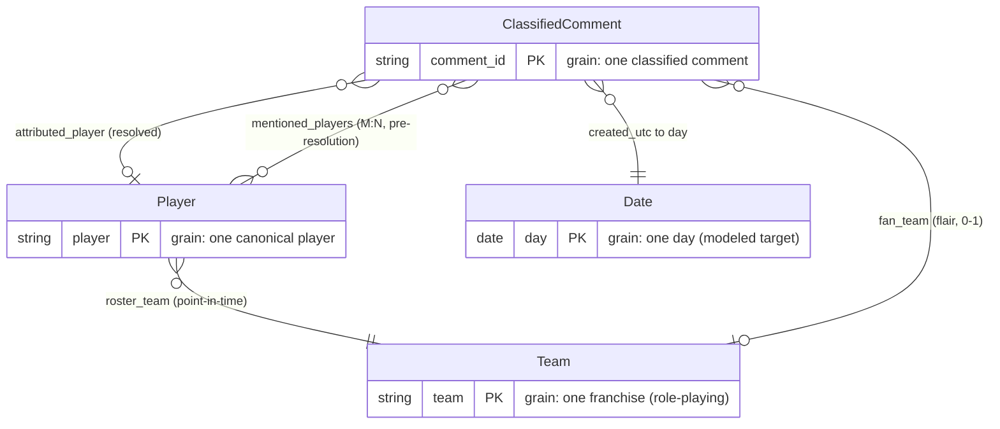

# Data Model — NBA Hate Tracker

**Purpose:** The shared conceptual vocabulary for V2 dashboard design. A new dashboard view is a question asked against this model; having the model written down is what lets you tell at a glance whether a question is **cheap** (already in an aggregate), **needs a join** (a dimension lookup, no new pipeline output), or **expensive** (a new aggregate view the pipeline must produce).

**How to read it:** The core model below — the ER diagram, the entity key, and the view-lineage table — is the authoritative *"is"*: what the pipeline produces today. The single fenced section at the very end, **Forward look (v3)**, is *"will be"* — direction, not built. Nothing in that section touches the core diagram or the present-now key.

`pipeline/schemas.py` is the source of truth for column *structure* (names + dtypes). This doc is the source of truth for the *relationships* between those structures.

---

## The model at a glance

A **star schema**: one fact at the center — `ClassifiedComment` — with three dimensions radiating out. `Team` is a **role-playing dimension**: the same franchise table is referenced in two distinct roles (a player's *roster* team and a commenter's *fan* team). `Date` is a **modeled target** — it does not exist as a table today (temporal lives as a derived `week` column), but the model names it because the V2 temporal work is built against it.

The diagram carries **structure only** — entity boxes, the role-playing edges, and each box's grain/key. Full attribute lists live in the entity key below, so the diagram stays readable and so forward-look attributes never appear to already exist.

The four aggregate views (`player_overall`, `player_temporal`, `player_team`, `team_overall`) are **rollups of the `ClassifiedComment` fact** and are not drawn as boxes; their lineage is the table in §4.

---

## 1. Entity key

### `ClassifiedComment` — fact

**Grain:** one classified comment (one row in `sentiment.parquet`). Comment and its classification are **one entity, not two**: they share a grain (each comment gets exactly one sentiment, one confidence, one resolved player), and the classification has no independent existence apart from the comment it describes. The classification fields belong *on the fact*, not in a separate dimension — `confidence` as a measure, `sentiment` as a categorical attribute you group by. (Where this doc says "comment," it means this entity — there is no separate raw-comment entity in the model.)

| Field | Role |
|---|---|
| `comment_id` | degenerate id (PK) |
| `body`, `author`, `created_utc`, `score` | event attributes |
| `sentiment` | categorical attribute (junk-dimension candidate) — you group by it; the `neg_count` / `pos_count` / `neu_count` rollups derived from it are the measures |
| `confidence` | numeric measure |
| `mentioned_players[]` | → **Player**, M:N — substring matches re-derived from `body` at assembly time under the active `players.yaml`, *pre-resolution* |
| `sentiment_player` | the classifier's single pick — a disambiguation input |
| `attributed_player` | → **Player**, the *resolved* single FK the aggregate views key on |
| `author_flair_text` → `fan_team` | → **Team** (fan role), 0-or-1 (flair may not resolve) |
| `created_utc` → `day` | → **Date** |

**The player FK is resolved, not raw.** `mentioned_players[]` (M:N) and `sentiment_player` are the *inputs*; `resolve_player()` collapses them to a single `attributed_player` (or null). The fact tables join on `attributed_player`. ~1.57M of ~1.93M classified rows resolve to a player.

**Two provenance layers on the fact.** The fact's attributes split into two classes with opposite change semantics:

- **Population + event/classification fields** — frozen at filter/classification time: `body`, `author`, `created_utc`, `score`, `link_id`, `sentiment`, `confidence`, `sentiment_player`. Re-running assembly never changes them; which comments exist in the fact (the population) is part of this frozen layer.
- **Config-versioned derivations** — `mentioned_players`, and therefore `attributed_player`: caches of `f(body, players.yaml@version)`, re-derived at every assembly and stamped with the config `version` into the parquet's file metadata. The stamp is checked at aggregation read time (drift → WARNING) — the config `version` field (major = roster, minor = alias) is load-bearing lineage metadata, not documentation.

The distinction matters because the two layers age differently: frozen fields stay correct forever, while a stored derivation is only as current as the config it was derived under — copying it forward through a rebuild silently reintroduces every alias fix made since. `fan_team` = `f(author_flair_text, teams.yaml)` is the **same attribute class** (a config-derived attribute, currently unversioned) — a future team-alias fix is this same problem and gets this same treatment, not a rediscovery.

> `link_id` — decided V2 addition for the v3 bridge; pending, must land before the classify run (see Forward look).

### `Player` — dimension

**Grain:** one canonical player. Materialized as `players.parquet`: the curated layer from `config/<season>/players.yaml` LEFT JOINed on `player_id` with the season roster snapshot (`data/<season>/reference/rosters.parquet`) — a snapshot gap nulls the snapshot attributes, it never drops the row. The nested `player_metadata` dict inside `aggregates.json` is a legacy serialization of the same dimension (curated attributes only).

| Field | Notes |
|---|---|
| `player` | canonical name (PK) |
| `roster_team` | → **Team** (roster role), from config. **Point-in-time** — see §3 |
| `conference`, `player_id`, `headshot_url` | curated attributes (config) |
| `position`, `birth_date`, `experience`, `school`, `jersey_number`, `height`, `weight` | snapshot attributes (roster snapshot, joined on `player_id`). Age is derived from `birth_date` at read time — a stored age is frozen at fetch |
| `aliases[]` | the substring fragments feeding `mentioned_players` matching. **Config-only, never materialized**: the dimension describes and slices; it does not select the population (selection = config tracked set + fact-side qualification) |

### `Team` — dimension (role-playing)

**Grain:** one franchise. Sourced from `config/teams.yaml`. Referenced in **two roles** today (see §2).

| Field | Notes |
|---|---|
| `team` | canonical name (PK) |
| `abbreviation`, `conference`, `team_id`, `logo_url` | descriptive attributes |
| `aliases[]` | the flair fragments feeding `fan_team` resolution |

### `Date` — dimension (modeled target, not yet materialized)

**Grain:** one day. **No Date table exists today** — temporal currently lives as a single derived column, `week` (`created_utc` truncated to Monday), on `player_temporal`. This box models the *target* shape that the V2 temporal page and cross-season work are designed against.

| Attribute | Status |
|---|---|
| `day` (key) | **target** — the modeled day grain |
| `week` / `week_of_season` | `week` is **present-now** (derived); `week_of_season` is **forward** |
| `season_phase` (regular / playoffs) | **near-term** — just a date cut, no external data |
| `event_label` ("what happened this week") | **v3** — needs game data |

The atomic fact stays at `created_utc` (seconds) and serves the replay directly; views roll up to day or week as the consumer needs.

---

## 2. The two `team` roles

`Team` is **one role-playing dimension**. The same franchise table is referenced in two roles, and an unmarked `team` is untenable once you have more than one — so the model marks them:

- **`roster_team`** — `Player → Team`. Who a player plays for.
- **`fan_team`** — `ClassifiedComment → Team`, resolved from the commenter's flair. Whose fan is talking.

**Decided convention:** mark the role everywhere as `roster_team` / `fan_team`.

**Current-column map:**

| Physical column | Role |
|---|---|
| `players.parquet.roster_team` | `roster_team` (role-marked physical name) |
| `player_metadata.team` (legacy JSON only) | `roster_team` |
| `player_team.team` | `fan_team` |
| `team_overall.team` | `fan_team` |

The fan-team columns still carry the unmarked physical name `team`; their rename is a **pending follow-up** (a separate ticket), not planned here. This doc records the concept and the mapping so the model and the code don't read as contradictory in the meantime.

---

## 3. Roster team is point-in-time

The `Player → Team (roster)` edge carries a fidelity ceiling worth stating plainly: **roster team is point-in-time, not static.** A traded player has different roster teams across weeks, but the season config and the Player dimension carry a single **season-end** team. So roster-keyed temporal and cross-season analysis mis-homes traded players (e.g. Luka). A trade-aware (slowly-changing) mapping is a future refinement; the model only flags the ceiling.

`jersey_number` sits under the same ceiling: it can change mid-season, and the dimension carries the snapshot's single value. The consequence class is cosmetic, which is why the ceiling is accepted rather than engineered around.

---

## 4. View lineage — cheap, needs-a-join, expensive

All four views are **fact tables** (rollups of `ClassifiedComment`); `Player` and `Team` are the **dimensions** joined in.

| View (parquet) | Grain | Derives from | Cheap question it already answers |
|---|---|---|---|
| `player_overall` | Player | fact → Player | "Draymond's overall hate" |
| `player_temporal` | Player × Week | fact → Player, Date(`week`) | "Draymond week over week" |
| `player_team` | Player × `fan_team` | fact → Player, Team(fan) | "Lakers fans about Draymond" |
| `team_overall` | `fan_team` | fact → Team(fan) | "Which fanbase is saltiest" |

**Needs a join** (no new pipeline output): any *roster-level* question — "OKC's roster sentiment over time," "own-fans vs. rivals" — joins a player-keyed view to `players.parquet` with `USING (attributed_player)` and groups by `roster_team` (or any other dimension attribute: position, experience, school).

**Expensive** (a new aggregate view the pipeline must produce): "How Lakers fans' sentiment toward Draymond moved *week over week*" needs a `player_team_temporal` view (Player × `fan_team` × Week) that doesn't exist. A new grain ⇒ a new pipeline output.

> **Non-additive measures guardrail:** the rate measures (`neg_rate`, `pos_rate`, `net_sentiment`, `polarization`) are **non-additive** — re-aggregate them from the counts (`neg_count` / `comment_count`), never by averaging rates across rows. (This is the salt-index lesson: a fanbase's true negativity is `sum(neg) / sum(total)`, not the mean of per-player rates.)

> **Known seam:** the *qualified-player* threshold (min 5,000 comments) is a business rule applied at read time and currently restated across the dashboard, notebooks, and the launch post rather than defined once. It's a metric-definition concern, not strictly entity-relationship — but it's a real semantic-layer gap: the model has no single place that says "qualified."

---

> ## Forward look (v3) — direction, not built
>
> This is the intended direction. **Nothing here is built or committed**, and the model above is what's real today — no entity or attribute below appears in the core diagram or the present-now key. Its two jobs: explain the V2 decisions that exist *because of* v3, and record the shape so the insight isn't lost.
>
> **`link_id` is the bridge, and capturing it in V2 is decided.** It is the single field that unlocks everything in this section. It must be added to `SENTIMENT_SCHEMA` and carried through `process_comments` **before the V2 classification run** — otherwise it is unrecoverable for this season. This is the one item here with a hard deadline. Recording the decision is this doc's job; the implementation is a pending Tier-1 action pointed at a ticket, not planned here.
>
> **`Post` (new entity)** — bridges `ClassifiedComment → Game` via `link_id`, and carries `post_type` (game thread / post-game / regular). `post_type` is what finally answers the recurring "did this include game threads?" feedback the V1 launch raised.
>
> **`Game` (new entity)** — `home_score`, `away_score`, `date`, with FKs to `home_team` / `away_team`. Note that `Game` is a *fact* in a basketball model but a *dimension* here — fact-vs-dimension is relative to the star you're in.
>
> **`Team` gains `home` / `away` roles** — four roles in total: `roster`, `fan`, `home`, `away`. This is *why* the core columns are marked `roster_team` / `fan_team`: an unmarked `team` was always going to collide.
>
> **Game data is the "why" layer.** It lets sentiment be *explained*, not just measured — criticism-vs-hate (negativity the box score predicts vs. the residual character hate) and event annotation (every spike self-labels with the game that caused it).
>
> **Modeling guardrail:** `Post` bridges `ClassifiedComment → Game`; `fan_team` stays on the `ClassifiedComment` (the commenter's flair), **not** on `Post`. The post a comment lived in tells you the *game*; the flair still tells you the *fan*.
