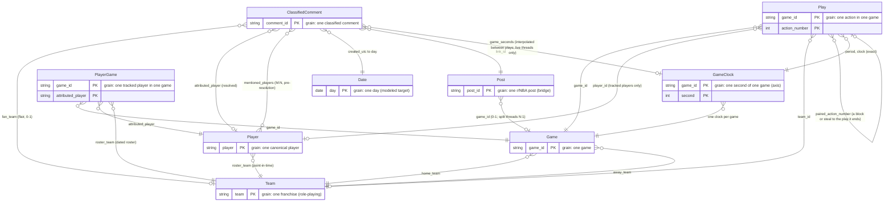

# Data Model — NBA Hate Tracker

**Purpose:** The shared conceptual vocabulary for V2 dashboard design. A new dashboard view is a question asked against this model; having the model written down is what lets you tell at a glance whether a question is **cheap** (already in an aggregate), **needs a join** (a dimension lookup, no new pipeline output), or **expensive** (a new aggregate view the pipeline must produce).

**How to read it:** The core model below — the ER diagram, the entity key, and the view-lineage table — is the authoritative *"is"*: what the pipeline produces today. The single fenced section at the very end, **Forward look (v3)**, is *"will be"* — direction, not built. Nothing in that section touches the core diagram or the present-now key.

`pipeline/schemas.py` is the source of truth for column *structure* (names, dtypes and nullability), published as `schema.json` beside the manifest. This doc is the source of truth for the *relationships* between those structures.

---

## The model at a glance

A **star schema**: one fact at the center — `ClassifiedComment` — with three dimensions radiating out, plus the **game layer**: `Game`, a dimension here (a fact in a basketball model — fact-vs-dimension is relative to the star you're in), `PlayerGame`, one tracked player's box-score line in one game, `Post`, the **bridge** from a comment to the game it lived in, and `Play`, one action in one game, which lives on a **second time axis**, `GameClock`. `Team` is a **role-playing dimension**: the same franchise table is referenced in four distinct roles (a player's *roster* team, a commenter's *fan* team, and a game's *home* and *away* teams). `Date` is absolute time, a **modeled target** — it does not exist as a table today (temporal lives as a derived `week` column), but the model names it because the V2 temporal work is built against it. `GameClock` is relative time, one clock per game: plays sit on it exactly, comments reach it by interpolation between the plays either side of them.

```mermaid
erDiagram
    ClassifiedComment {
        string comment_id PK "grain: one classified comment"
    }
    Player {
        string player PK "grain: one canonical player"
    }
    Team {
        string team PK "grain: one franchise (role-playing)"
    }
    Date {
        date day PK "grain: one day (modeled target)"
    }
    Game {
        string game_id PK "grain: one game"
    }
    PlayerGame {
        string game_id PK "grain: one tracked player in one game"
        string attributed_player PK
    }
    Post {
        string post_id PK "grain: one r/NBA post (bridge)"
    }
    Play {
        string game_id PK "grain: one action in one game"
        int action_number PK
    }
    GameClock {
        string game_id PK "grain: one second of one game (axis)"
        int second PK
    }

    Player            }o--|| Team      : "roster_team (point-in-time)"
    ClassifiedComment }o--o| Team      : "fan_team (flair, 0-1)"
    ClassifiedComment }o--o| Player    : "attributed_player (resolved)"
    ClassifiedComment }o--o{ Player    : "mentioned_players (M:N, pre-resolution)"
    ClassifiedComment }o--|| Date      : "created_utc to day"
    ClassifiedComment }o--|| Post      : "link_id"
    ClassifiedComment }o--o| GameClock : "game_seconds (interpolated between plays; live threads only)"
    Post              }o--o| Game      : "game_id (0-1; split threads N:1)"
    Game              }o--|| Team      : "home_team"
    Game              }o--|| Team      : "away_team"
    PlayerGame        }o--|| Game      : "game_id"
    PlayerGame        }o--|| Player    : "attributed_player"
    PlayerGame        }o--|| Team      : "roster_team (dated roster)"
    Play              }o--|| Game      : "game_id"
    Play              }o--o| Player    : "player_id (tracked players only)"
    Play              }o--o| Team      : "team_id"
    Play              }o--o| Play      : "paired_action_number (a block or steal to the play it ends)"
    Play              }o--|| GameClock : "period, clock (exact)"
    GameClock         }o--|| Game      : "one clock per game"
```

The diagram carries **structure only** — entity boxes, the role-playing edges, and each box's grain/key. Full attribute lists live in the entity key below, so the diagram stays readable and so forward-look attributes never appear to already exist. Every solid edge is a stored key. The one derived edge, comment to `GameClock`, is computed, never stored on the fact: a comment sits *near* plays on a shared clock, and there is no comment-to-play key.

The pipeline produces three classes of table from this model: **rollups** of the `ClassifiedComment` fact (the five aggregate views — `player_overall`, `player_temporal`, `player_fan_team`, `fan_team_overall`, `game_sentiment`: measures at a coarser grain), the **dimensions** (`players`, `teams`, `games`), and a **fact subset** (`comment_samples`: verbatim rows of the fact at its own grain, selected not aggregated). `PlayerGame` is materialized as `player_games`, a dimension-side table with its own grain, `Post` as `posts`, the bridge at its own grain, and `Date` as `corpus_daily`, the day grain with the corpus funnel's counts. The subset is not a new entity — it *is* the `ClassifiedComment` box, sliced; the rollups are derived from the fact, not from the subset. A **recap** is the one produced file that is not a table: three of these classes in one document (§4). The lineage of all of them is the table in §4.

---

## 1. Entity key

### `ClassifiedComment` — fact

**Grain:** one classified comment (one row in `sentiment.parquet`). Comment and its classification are **one entity, not two**: they share a grain (each comment gets exactly one sentiment, one confidence, one resolved player), and the classification has no independent existence apart from the comment it describes. The classification fields belong *on the fact*, not in a separate dimension — `confidence` as a measure, `sentiment` as a categorical attribute you group by. (Where this doc says "comment," it means this entity — there is no separate raw-comment entity in the model.)

| Field | Role |
|---|---|
| `comment_id` | degenerate id (PK) |
| `body`, `author`, `created_utc`, `score` | event attributes |
| `sentiment` | categorical attribute (junk-dimension candidate) — you group by it; the `neg_count` / `pos_count` / `neu_count` rollups derived from it are the measures |
| `confidence` | numeric measure |
| `mentioned_players[]` | → **Player**, M:N — substring matches re-derived from `body` at assembly time under the active `players.yaml`, *pre-resolution* |
| `sentiment_player` | the classifier's single pick — a disambiguation input |
| `attributed_player` | → **Player**, the *resolved* single FK the aggregate views key on — materialized on the fact at assembly |
| `author_flair_text` → `fan_team` | → **Team** (fan role), 0-or-1 (flair may not resolve) — materialized on the fact at assembly |
| `link_id` | → **Post**, the post the comment lived in; the comment's only path to a **Game** |
| `created_utc` → `day` | → **Date** |
| `created_utc` → `game_seconds`, `phase` | → **GameClock**, derived in a recap only: interpolated between the two plays either side of the comment on wall clock. Never a column of the fact |

**The player FK is resolved, not raw.** `mentioned_players[]` (M:N) and `sentiment_player` are the *inputs*; `resolve_player()` collapses them to a single `attributed_player` (or null), and the result is stored on the fact. The fact tables join on `attributed_player`. ~1.57M of ~1.93M classified rows resolve to a player.

**Resolution happens once, at assembly.** `attributed_player` and `fan_team` are columns of `sentiment.parquet`, not something a reader derives. Every consumer of the fact — the aggregate views, the receipts pool, notebooks, anything reading the parquet outside Python — sees the same resolution, because there is exactly one. A reader that re-implemented the resolver would drift from the pipeline the first time an alias changed; storing the derivation under a config stamp is what makes that class of bug impossible.

**Two provenance layers on the fact.** The fact's attributes split into two classes with opposite change semantics:

- **Population + event/classification fields** — frozen at filter/classification time: `body`, `author`, `created_utc`, `score`, `link_id`, `sentiment`, `confidence`, `sentiment_player`. Re-running assembly never changes them; which comments exist in the fact (the population) is part of this frozen layer.
- **Config-versioned derivations** — `mentioned_players` and `attributed_player`, caches of `f(body, sentiment_player, players.yaml@version)`, and `fan_team`, a cache of `f(author_flair_text, teams.yaml@version)`: re-derived at every assembly and stamped with their config `version` into the parquet's file metadata (`players_config_version`, `teams_config_version`). Both stamps are checked at aggregation read time (drift → WARNING) — the config `version` field (major = roster, minor = alias) is load-bearing lineage metadata, not documentation.

The distinction matters because the two layers age differently: frozen fields stay correct forever, while a stored derivation is only as current as the config it was derived under — copying it forward through a rebuild silently reintroduces every alias fix made since. That is why the derived columns are never projected from an earlier file: assembly recomputes all three from the frozen layer, so a rebuild under a newer config is a correct rebuild by construction. `teams.parquet` carries the same `teams.yaml` stamp for the dimension side.

### `Player` — dimension

**Grain:** one canonical player. Materialized as `players.parquet`: the curated layer from `config/<season>/players.yaml` LEFT JOINed on `player_id` with the season roster snapshot (`data/<season>/reference/rosters.parquet`) — a snapshot gap nulls the snapshot attributes, it never drops the row. Every player-keyed table carries the dimension's `player_id` beside `attributed_player`, so a consumer joins on either.

| Field | Notes |
|---|---|
| `player` | canonical name (PK) |
| `slug` | URL identity, derived from the name at build (NFKD-fold, lowercase, non-alphanumerics → one hyphen), asserted unique. Read by the frontend, never re-derived |
| `roster_team` | → **Team** (roster role), from config. **Point-in-time** — see §3 |
| `conference`, `player_id`, `headshot_url` | curated attributes (config) |
| `position`, `birth_date`, `experience`, `school`, `jersey_number`, `height`, `weight` | snapshot attributes (roster snapshot, joined on `player_id`). Age is derived from `birth_date` at read time — a stored age is frozen at fetch |
| `aliases[]` | the substring fragments feeding `mentioned_players` matching. **Config-only, never materialized**: the dimension describes and slices; it does not select the population (selection = config tracked set + fact-side qualification) |

### `Team` — dimension (role-playing)

**Grain:** one franchise. Materialized as `teams.parquet`: a pure export of `config/teams.yaml` — all 30 franchises in config order, no fact dependency. The file carries the `teams.yaml` `version` in its parquet metadata (the same lineage stamp mechanism as the Player dimension). Referenced in **four roles** (see §2).

| Field | Notes |
|---|---|
| `team` | canonical name (PK) |
| `abbreviation`, `conference`, `team_id`, `logo_url` | descriptive attributes |
| `aliases[]` | the flair fragments feeding `fan_team` resolution |

### `Game` — dimension

**Grain:** one game. Materialized as `games.parquet`, pivoted from the season's team game-log snapshot (`data/<season>/reference/team_game_log.parquet`, stats.nba.com `LeagueGameLog`, every season type). The snapshot holds both sides of every game as the endpoint serves them; the dimension decides what ships: exhibitions against non-NBA opponents are dropped, and a game whose two lines both read "away" (a neutral site) is flagged, its sides assigned by `team_id` so the row does not depend on endpoint order.

| Field | Notes |
|---|---|
| `game_id` | stats.nba.com id (PK); the prefix encodes the season type and, for playoffs, `004 YY 00 R S G` |
| `game_date`, `season_type` | `pre_season` / `regular_season` / `play_in` / `playoffs`, decoded from the id prefix; the NBA Cup final (its own prefix) sits in the regular-season window under `nba_cup_final` |
| `home_team`, `away_team`, `winner` | → **Team** (home / away roles), canonical names |
| `home_score`, `away_score` | measures of the game, not of the star |
| `playoff_round`, `playoff_series`, `playoff_game` | parsed from the id; null outside the playoffs |
| `neutral_site` | see above |

### `PlayerGame` — one player in one game

**Grain:** one tracked player's box-score line in one game. Materialized as `player_games.parquet` from the player game-log snapshot (`player_game_log.parquet`, every player who dressed), selected to the Player dimension by `player_id` under the active `players.yaml`. A tracked player with no line is absent, never fabricated. Not a rollup of the fact — it carries the game's measures (`pts`, `reb`, `plus_minus`, …), and the comment-side view at the same grain is a separate rollup, `game_sentiment` (see §4).

| Field | Notes |
|---|---|
| `game_id`, `attributed_player` | PK; → **Game**, → **Player** (the dimension's key name, so the join to the comment-side view at this grain is on identical columns); `player_id` rides beside the key |
| `roster_team` | → **Team**, the **dated roster role**: the player's team on that line — see §3 |
| `opponent`, `is_home` | → **Team**; `is_home` is derived from `games.home_team`, and null on a neutral-site game, where neither side hosted |
| `wl`, `minutes`, the box-score line, `plus_minus` | as the endpoint serves them |

### `Post` — bridge

**Grain:** one r/NBA post. Materialized as `posts.parquet`, a subset of the full bridge the pipeline keeps in `data/<season>/reference/posts_bridge.parquet` (every post of the season, derived from the raw posts download). The bridge says which game a comment lived in; it is not a dimension of the comment. `fan_team` stays on `ClassifiedComment` — the post tells you the *game*, the flair still tells you the *fan*.

| Field | Notes |
|---|---|
| `post_id` | the `t3_` fullname, equal to the fact's `link_id` (PK) |
| `title`, `created_utc`, `score`, `num_comments`, `link_flair_text` | as the source. `num_comments` is the whole room, not the fact-row count |
| `post_type` | the room a comment was written in: `game_thread` / `post_game_thread` / `highlight` / `lowlight` / `injury` / `news` / `discussion` / `other`. Flair decides; an unflaired post is read by its title, an anchored thread prefix first (flair-stripped removals), then its leading `[Tag]`. A tag is a type in itself (`[Lowlight]`), a convention that names no source (`[OC]`, a date), or a source, which makes the post `news` |
| `source` | the leading tag of a `news` post, lowercased: the reporter, the outlet, or the person quoted. As written in the title, so one reporter may appear under more than one spelling. Null on every other type |
| `game_id` | → **Game**, 0-or-1, on threads only. Resolved from the title's unordered team pair and the Eastern day of `created_utc`, validated against `games` at aggregation; null on non-games, non-NBA opponents and postponements |
| `is_primary` | the largest thread by `num_comments` per (`game_id`, `post_type`); split, second-half and repost threads share a `game_id` |

**Published subset:** every game and post-game thread, plus every post a receipt points at (its title is the receipt's context). A game's room is the **sum** of `num_comments` over its threads — a second-half thread can outgrow the primary.

### `Play` — dimension

**Grain:** one action in one game. A fact in a basketball model, a dimension here, like `Game`. Sourced from the banked liveData play-by-play (`data/<season>/reference/play_by_play_live/<game_id>.parquet`, one snapshot per game as the feed serves it); published only inside a recap, which ships one game's plays whole: every row of the feed but its closing one. The feed is the game as scored on the night: corrections made afterwards reach the box score and never the feed, and a recap keeps the night-of version, which is what the room reacted to.

| Field | Notes |
|---|---|
| `game_id`, `action_number` | PK; `action_number` is unique within a game, the row key |
| `paired_action_number` | the shot or turnover a block or steal ends: the one self-relation. The feed logs the ender right after the play it ended, and the play names the ender in its own field. A block borrows its shot's location |
| `period`, `clock`, `game_seconds` | the clock as served, and seconds elapsed since tip-off (720 per period, 300 per overtime) |
| `wall_clock` | epoch seconds, the play's own timestamp: when the scorer logged it, made monotone in feed order |
| `kind` | the feed's action type under the recap's vocabulary; a heave is a kind of its own, a shot the feed credits to the team only |
| `person_id` → `player_id` | → **Player**, 0-or-1: the row names any player in the game and the dimension holds the tracked ones; 0 on a team action. A substitution is two rows, `in` and `out`, each naming its own player, and the lineup changes at a period break are logged at the period's first second; only the first period's opening five is inferred, and every player's on-court state is written as **stints** |
| `assist_person_id` | the passer, on the made shot he assisted |
| `team_tricode` | the feed's abbreviation under its own name; not a Team FK |
| `x`, `y` | the feed's full-court position, 0–100 along and across the court, on a located play; `x` says which basket a team attacks |
| `score_home`, `score_away` | on every row, as the feed serves it |

A player's line is not stored: it is counted from the rows (field goals, free throws, rebounds, assists, steals, blocks, turnovers, personal fouls), and the build checks that count, each team's points and every player's stint minutes against the box score.

### `GameClock` — axis (relative time)

**Grain:** one second of one game. Not a table: the function the plays' timestamps define, written into each recap as its `periods` frame and read off its `plays`. Beside `Date` (absolute time) it is the model's second time dimension, and it exists only inside a game.

| Field | Notes |
|---|---|
| `game_id`, `second` | one clock per game; seconds elapsed since tip-off |
| `period`, `clock` | the display form |
| `wall_clock` | epoch seconds. Every play carries its own timestamp, so a period's bounds are its markers' stamps and a comment maps between the two plays either side of it: flat wherever the feed logs a row on a frozen second, as it does at a timeout's end, breaks pinned to the break |
| `phase` | `pre` / `live` / `break` / `post`: where a comment fell |
| the reaction lag | the reaction anchors: any tracked player's block, steal or made dunk that comments about him name, by a published vocabulary, within a minute; one burst of comments counts for one play. The clock is the feed's own, so what the anchors' distance from the play measures is how long the room takes to react, **measured** once per season over every threaded game and published with the rules; the timeline is never moved by them |

`Play` sits on the clock exactly. `ClassifiedComment` reaches it by interpolation between the plays either side of it, a derivation like `mentioned_players`, never a stored key. That is why the rule is stated plainly: **a comment is never joined to a play**. It is placed on the same clock, and the page reads the two side by side.

### `Date` — dimension (materialized at day grain as `corpus_daily`)

**Grain:** one day. The day grain is materialized as `corpus_daily`: one row per UTC day of the download's extent, carrying the corpus funnel's counts for that day (raw, submitted, usable, attributed) under the same names the manifest's `corpus` block uses, so each column sums to the season figure of that name. It is not player-keyed — the Player × Day grain is the temporal page's *weekly* view, `player_temporal`, whose `week` (`created_utc` truncated to Monday) remains a derived column rather than a join. This box models the rest of the *target* shape the temporal page and cross-season work are designed against.

| Attribute | Status |
|---|---|
| `day` (key) | **present-now** — `corpus_daily.day` |
| `week` / `week_of_season` | `week` is **present-now** (derived); `week_of_season` is **forward** |
| `season_phase` (regular / playoffs) | **near-term** — just a date cut, no external data |
| `event_label` ("what happened this week") | **v3** — needs game data |

The atomic fact stays at `created_utc` (seconds) and serves the replay directly; views roll up to day or week as the consumer needs.

### The accuracy sample — reference asset

**Grain:** one drawn comment. Kept as `data/<season>/reference/accuracy_sample.parquet`, never published as a table: every row of a blind, uniform random draw of the **attributed** population, with the classifier's own labels and, where entered, the manual verdict (sentiment, target, or a reject reason). The draw is seeded, shuffled and its ids are stored, so the file is scored without the fact and any top-down prefix of it is itself a random sample.

The rows are labeled in two groups, and the group is a column. Rows chosen freely in a first pass are counted in full; every other row is the ordered group, labeled top-down in draw order and refused at import if a row was skipped. Rows set aside from the estimate (a verdict entered after seeing a model's read) are held out. The manifest's `rules.accuracy` block is the only accuracy figure the pipeline produces, and every share in it weights the two groups by their sizes in the draw, with a 95% margin that carries both the draw's own variance and the ordered group's sampling: sentiment agreement, target agreement over the rows the manual read calls positive or negative, their joint, per-class precision, recall and toward-precision, each side's class mix, and the shares that needed the thread, were judged a coin flip, or were not a valid input at all. The rubric the verdicts follow is versioned in the block: sentiment is how the comment feels about the player, valuing a player counts as positive, and a neutral comment's target is the player it mentions.

It is distinct from the eval suite under `tests/eval/`, whose cases are chosen for difficulty and whose floors guard against regression; a pass rate there describes the suite, not the corpus. The file carries the players-config version its target lists were built under and the sentiment classifier's identity, and aggregation warns when either differs from the fact it is scoring.

---

## 2. The `team` roles

`Team` is **one role-playing dimension**. The same franchise table is referenced in four roles, and an unmarked `team` is untenable once you have more than one — so the model marks them:

- **`roster_team`** — `Player → Team`. Who a player plays for (season-end).
- **`fan_team`** — `ClassifiedComment → Team`, resolved from the commenter's flair. Whose fan is talking.
- **`home_team`** / **`away_team`** — `Game → Team`. Who hosted, who visited.
- **`roster_team`** on `PlayerGame` — the dated roster role: who the player played for in that game; `opponent` is its counterpart. Same name as the dimension's season-end column, a different grain (§3).

**Decided convention:** mark the role everywhere as `roster_team` / `fan_team` / `home_team` / `away_team` — on columns and, for the two views keyed by the fan role, on the table name (`player_fan_team`, `fan_team_overall`). Every Team FK carries the dimension's canonical name, never an abbreviation, so every join is `ON <role>_team = teams.team`. Bare `team` is the dimension's own PK and nothing else; a registry test enforces it over every produced table.

**Current-column map:**

| Physical column | Role |
|---|---|
| `players.parquet.roster_team` | `roster_team` (role-marked physical name) |
| `player_fan_team.fan_team` | `fan_team` (role-marked physical name) |
| `fan_team_overall.fan_team` | `fan_team` (role-marked physical name) |
| `comment_samples.fan_team` | `fan_team` (role-marked physical name) |
| `games.home_team`, `games.away_team`, `games.winner` | `home_team` / `away_team` (role-marked physical names) |
| `player_games.roster_team`, `player_games.opponent` | dated roster role (grain-scoped) |

Every produced file carries the role-marked name.

---

## 3. Roster team is point-in-time

The `Player → Team (roster)` edge carries a fidelity ceiling worth stating plainly: **roster team is point-in-time, not static.** A traded player has different roster teams across weeks, but the season config and the Player dimension carry a single **season-end** team, which is the label the dimension keeps (as NBA.com does). The dated edge exists elsewhere: `player_games.roster_team` is the player's team on each game line, so a roster-keyed temporal question can join through `player_games` instead of the dimension when the trade matters. Views keyed on `roster_team` still carry the season-end ceiling.

`jersey_number` sits under the same ceiling: it can change mid-season, and the dimension carries the snapshot's single value. The consequence class is cosmetic, which is why the ceiling is accepted rather than engineered around.

---

## 4. View lineage — cheap, needs-a-join, expensive

Three classes of produced table: the five views are **rollups** of `ClassifiedComment` (fact tables with measures at a coarser grain); `Player`, `Team` and `Game` are the **dimensions** joined in; `comment_samples` is a **fact subset** — verbatim rows of `ClassifiedComment` at its own grain, selected (top-N per player × sentiment by score, under candidacy gates; a pos/neg receipt additionally requires a second-pass verdict that the sentiment is directed *at* the attributed player, not merely about them — the verifier's re-derived target, resolved under the active alias map, must match) rather than aggregated. Attribution counts every resolved comment; a receipt held up as *what was said about this player* holds the stricter bar. A season without verdicts falls back to the classifier's stated target as the gate, and the file says so (`receipts_verified`), so a consumer never mistakes the weaker bar for the stronger one.

| Table (parquet) | Grain | Derives from | Cheap question it already answers |
|---|---|---|---|
| `player_overall` | Player | fact → Player | "Draymond's overall hate" |
| `player_temporal` | Player × Week | fact → Player, Date(`week`) | "Draymond week over week" |
| `player_fan_team` | Player × `fan_team` | fact → Player, Team(fan) | "Lakers fans about Draymond" |
| `fan_team_overall` | `fan_team` | fact → Team(fan) | "Which fanbase is saltiest" |
| `game_sentiment` | Player × Game | fact → Post → Game, Player | "The room's verdict on Draymond in Game 7" — counts and rates for the player, plus `thread_comment_count`, the fact rows in that game's threads across all players |
| `comment_samples` | Player × sentiment × rank | fact → Player, Team(fan) | "The receipts: what a Lakers fan actually said about Draymond" |
| `corpus_daily` | Day | raw download → Date(`day`); fact for `usable` / `attributed` | "How loud was the sub on June 11, and how much of it was about someone" |

Every player-keyed table (`player_overall`, `player_temporal`, `player_fan_team`, `game_sentiment`, `player_games`, `comment_samples`) carries `player_id` right after `attributed_player`: the name is the display key, the id the stable one.

The fact subset makes *"show me the receipts"* **cheap** while leaving *"show me every comment"* deliberately **expensive** — the atomic fact is not a shipped table; a full drill is a separate engine (v3), not a view.

**Recaps** are the one produced file that is not a table. `recaps/<game_id>-<slug>.json` bundles three of the classes above for one curated (game, player): a **fact subset** at comment grain (every usable comment in the game's live threads, on both clocks, each naming its target by `player_id`, with `body` kept by a published rule), a **dimension slice** (the game's `Play` rows, whole, and its `periods`, the `GameClock`), and every player's on-court intervals (`stints`). Each frame is a table serialized as column arrays, validated like every produced table, and described in `schema.json` under `documents.recap`. Nothing already in a table is copied in: the page joins `games`, `player_games`, `game_sentiment` and `players` by `game_id` and `player_id`. The manifest's `recaps` registry entry is a **rollup** at Player × Game × Period (counts per period, the swing in negative share, the stint difference), so an index renders from the manifest alone. The room's reaction lag is not per file: it is measured once, season-wide, and published under the manifest's rules. The recap quotes the live thread; `game_sentiment`, which also counts the post-game threads, is a different population and is shown beside it as the final verdict.

**Needs a join** (no new pipeline output): any *roster-level* question — "OKC's roster sentiment over time," "own-fans vs. rivals" — joins a player-keyed view to `players.parquet` with `USING (attributed_player)` (or `USING (player_id)`) and groups by `roster_team` (or any other dimension attribute: position, experience, school). Likewise a box score beside a sentiment number: `player_games` joins `game_sentiment` on `(game_id, attributed_player)`, and `games` supplies the date, score and phase. The box score is never pre-joined into a rollup, and neither is the whole-room thread size — that is `posts.num_comments` summed per `game_id`, distinct from the view's `thread_comment_count` (fact rows only). A comment reaches its game through the bridge — `posts` on `link_id = post_id`, then `game_id` — and every hop is many-to-one, so a comment lands in at most one game. The view ships counts, never a verdict: the baseline a game is judged against (the player's season rate) and the display floor are consumer choices.

**Expensive** (a new aggregate view the pipeline must produce): "How Lakers fans' sentiment toward Draymond moved *week over week*" needs a `player_fan_team_temporal` view (Player × `fan_team` × Week) that doesn't exist. A new grain ⇒ a new pipeline output.

> **Non-additive measures guardrail:** the rate measures (`neg_rate`, `pos_rate`, `net_sentiment`, `polarization`) are **non-additive** — re-aggregate them from the counts (`neg_count` / `comment_count`), never by averaging rates across rows. (This is the salt-index lesson: a fanbase's true negativity is `sum(neg) / sum(total)`, not the mean of per-player rates.) `thread_comment_count` on `game_sentiment` is a game-level count repeated on each of the game's player rows — never sum it across players. The guardrail has no purchase on the fact subset — it carries no measures, nothing to re-aggregate; its one rule is that `body` is never truncated (a receipt is verbatim or it isn't a receipt).

> **The semantic layer lives in the manifest.** The *qualified-player* threshold (min 5,000 comments) is a business rule applied at read time, not a property of any entity; `manifest.json` publishes it under `rules.qualified_threshold`, beside the samples rule, the display floors, the rate formulas and the receipts figures, so every surface reads the rule instead of restating it. The same file names the comment population each fact table draws from (`tables.<name>.population`, defined in `populations`), which is how the three "disagreeing" totals — attributed, flaired, in-thread — are three universes, not an inconsistency.

---

> ## Forward look (v3) — direction, not built
>
> This is the intended direction. **Nothing here is built or committed**, and the model above is what's real today — no entity or attribute below appears in the core diagram or the present-now key. Its two jobs: explain the V2 decisions that exist *because of* v3, and record the shape so the insight isn't lost.
>
> **Game data is the "why" layer.** It lets sentiment be *explained*, not just measured — criticism-vs-hate (negativity the box score predicts vs. the residual character hate) and event annotation (every spike self-labels with the game that caused it). Both halves ship: `game_sentiment` is the comment side, `player_games` the box-score side, joined client-side on `(game_id, attributed_player)`. The explanation itself — how much of a game's negativity the box score predicts — is a model over that join, not a table.
>
> **Player × Game × Period is a grain, not yet a view.** The recap's gauge, its index hook and the candidate scan are all reads of the same rollup: the focus player's counts per period of the game clock. Today it is materialized per curated recap (the registry entry) and privately over every threaded game (the scan's report, never published). It is computable for every game with a live thread in seconds, so a `player_game_period` view — "when in the game did the room turn on him", for any game — would be a promotion of what exists, not a redesign. Curation stays the product until a page asks for every game.
